# demo-UCD-OCP

demoing for deploying apps to openshift using urbancode deploy

## Kubetoy

[UCD Application Export json](KubeToy.json)

## Setup

### KubeToy App

#### KubeToy Settings

* 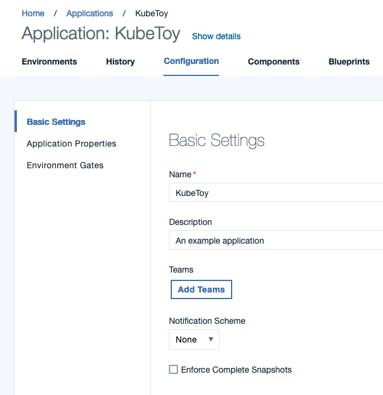

#### Environments

* 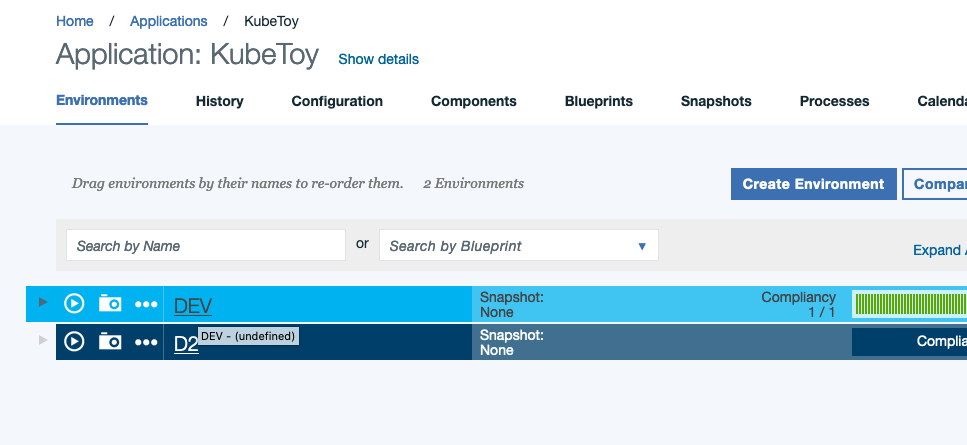

#### ENV Resources

* 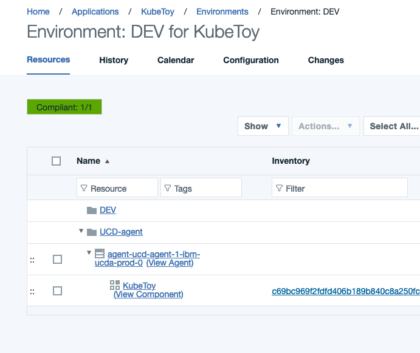

#### ENV Properties
  
* oc-project: ozdemo01
* oc-token: Token to get from [copy login commands]
* oc-url: url to get from [copy login commands]
* 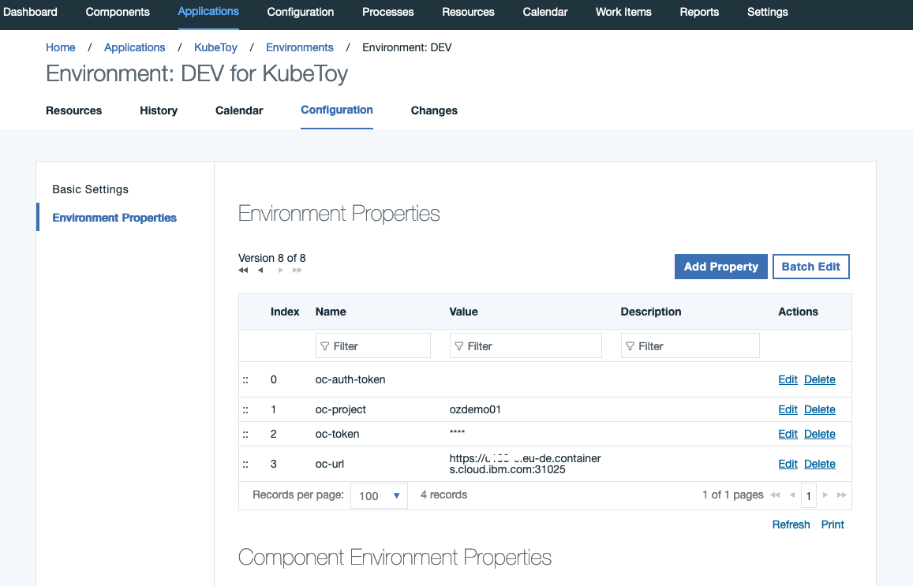

### KubeToy component

#### component configuration

* Source Configuration Type: git
* [Repository url](https://github.com/IBM-ICP-CoC/KubeToy.git): <https://github.com/IBM-ICP-CoC/KubeToy.git>

* 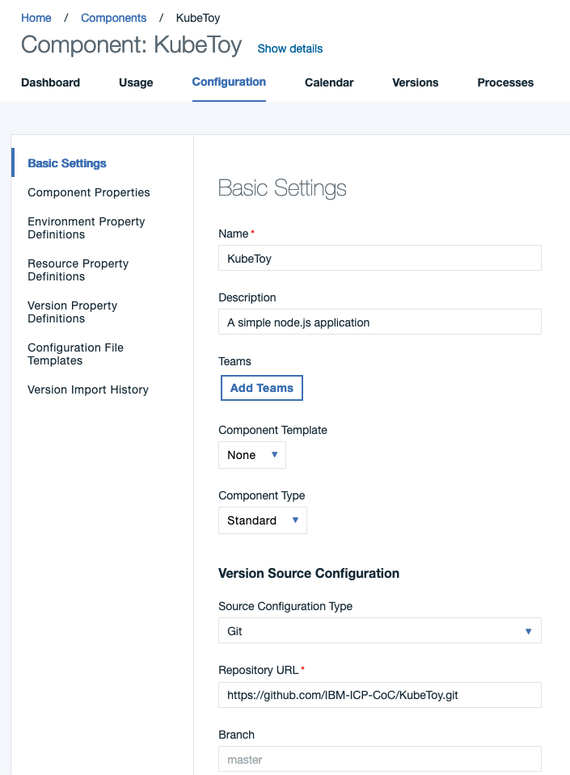
* 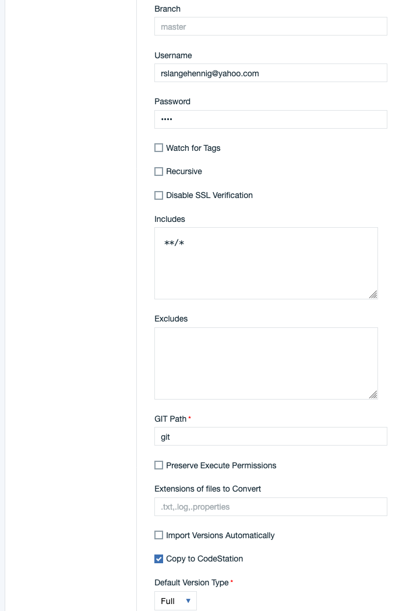
* 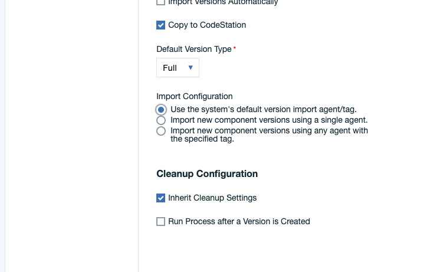

#### Processes

* Deploy
  * using mostly OCP Plugin steps
  * 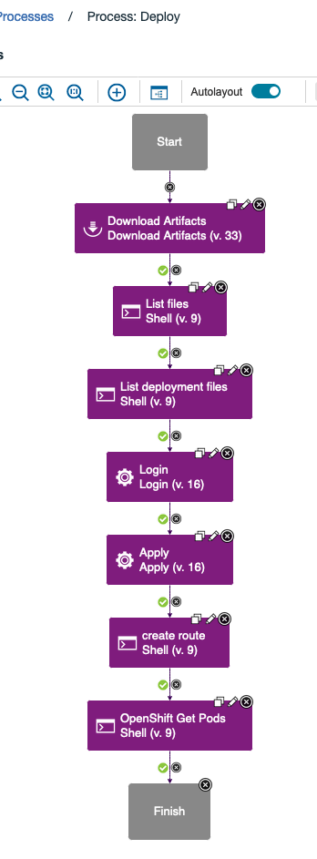
    * STEPS
      * 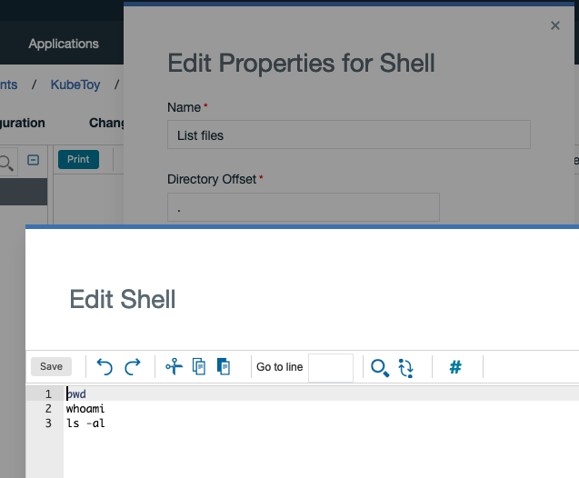 and 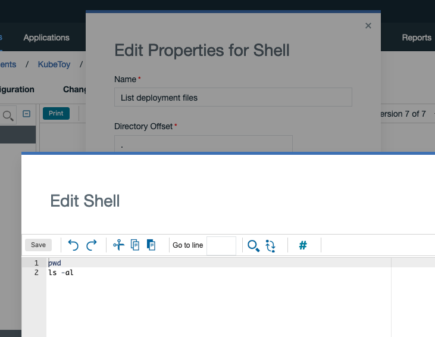 are shell steps to show downloaded files
      * Login:
        * 
        * for the token field i have used the reference
        *

         ~~~sh
         ${p:environment/oc-token}
         ~~~

      * Apply:
        * 
        * File to use: kubetoy-all-in-one.yaml
        * for Access Token i have used:

        ~~~sh
         ${p:environment/oc-token}
        ~~~

      * Create Route:
        * 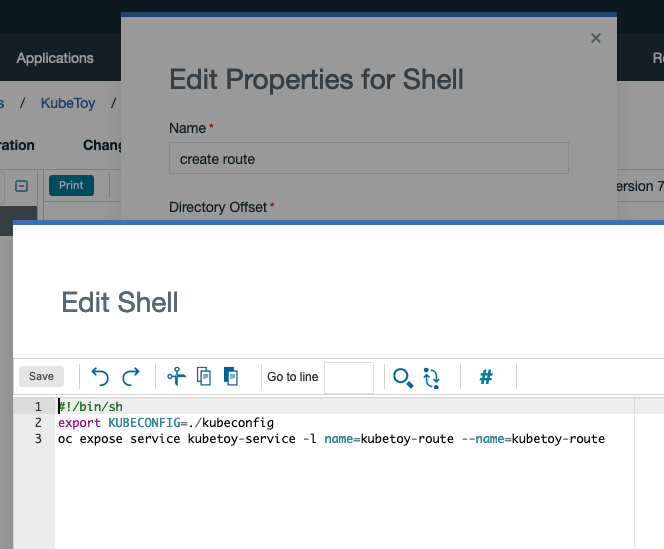

        ~~~sh
        #!/bin/sh
        export KUBECONFIG=./kubeconfig
        oc expose service kubetoy-service -l name=kubetoy-route --name=kubetoy-route
        ~~~

        * no create route step available
      * OpenShift get Pods (Shell)

        ~~~sh
        oc login --token=${p:environment/oc-token} --server=${p:environment/oc-url}
        oc get pods
        ~~~

* Deploy-Kubetoy
  * uses shell commands
  * 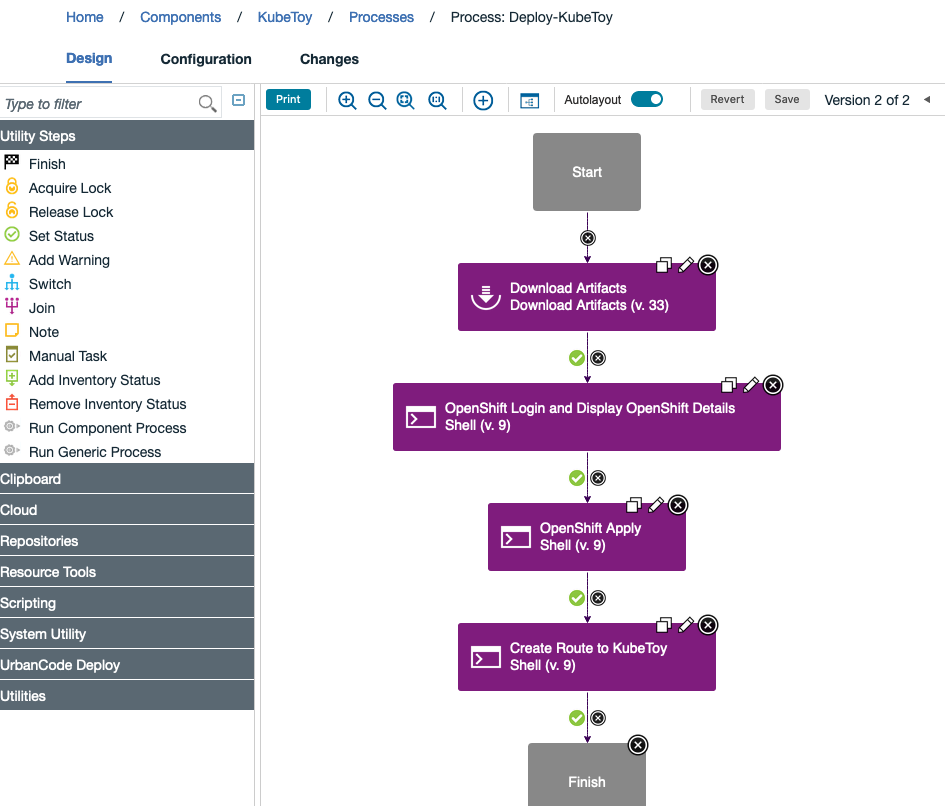
  * 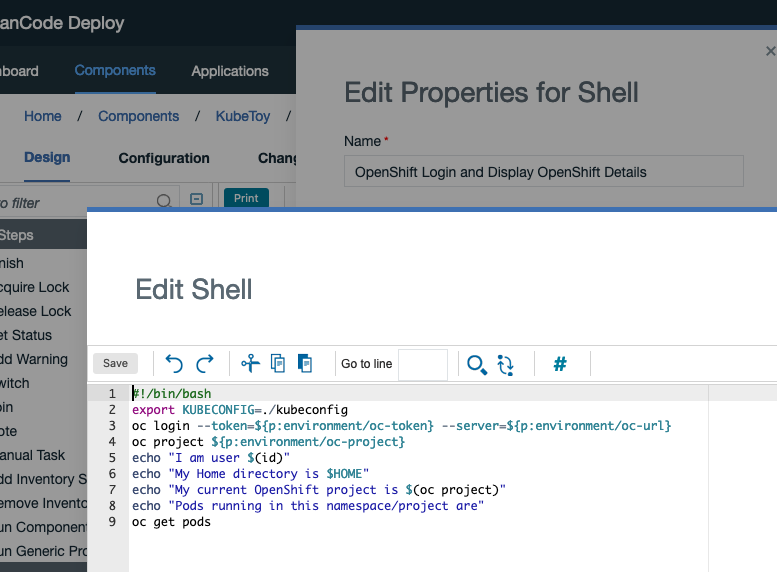
  * 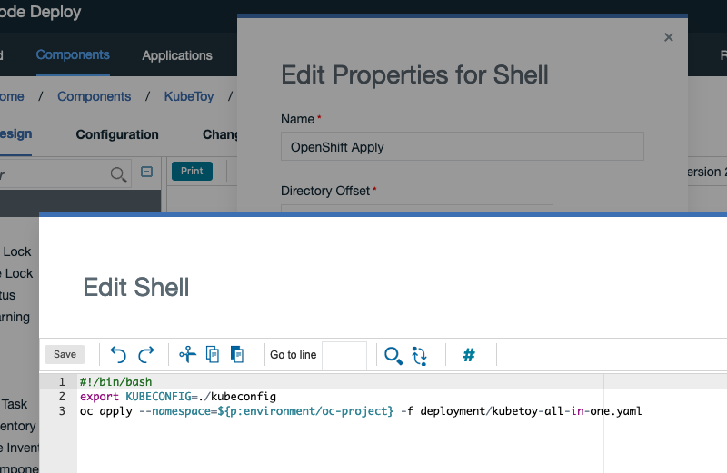
  * 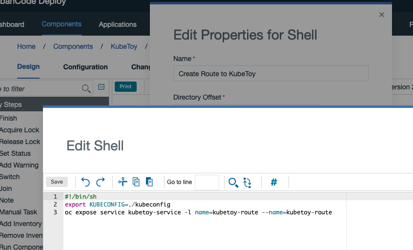
